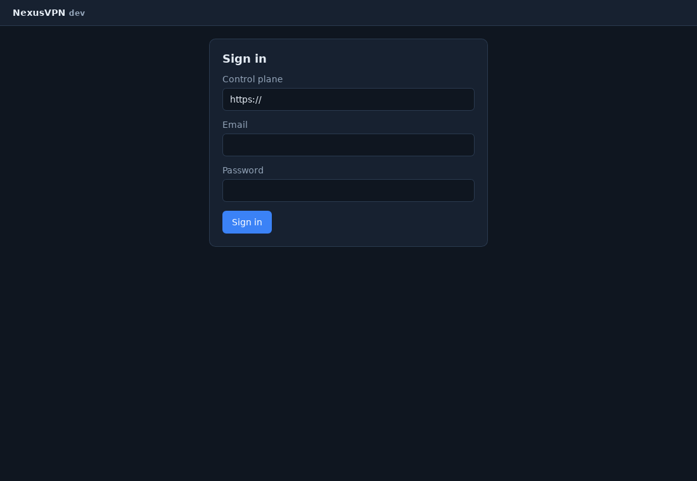

# NexusVPN Desktop

A native desktop app for Windows 11, Windows Server, macOS and Linux, built
with [Wails v2](https://wails.io) (Go backend + React/TypeScript UI in the
platform's own WebView).

It drives the **same tunnel engine as `nexusvpnctl`** through the shared
`client/agent` package, so the GUI and the CLI cannot diverge in how they
establish connectivity.



## Features

- Sign in to any control plane (self-hosted or hosted), including MFA
- Create networks, join by invite code
- One-click connect, with live peer status showing whether each peer is
  **direct** (hole-punched) or **relayed**, plus transfer counters
- Live engine activity log streamed from the Go side over Wails events
- Device rename and key rotation

## Build

Requires Go 1.25+, Node 20+, and the
[Wails CLI](https://wails.io/docs/gettingstarted/installation):

```bash
go install github.com/wailsapp/wails/v2/cmd/wails@v2.13.0
```

```bash
# Linux (needs libgtk-3-dev and libwebkit2gtk-4.1-dev)
wails build -platform linux/amd64 -tags webkit2_41

# Windows
wails build -platform windows/amd64
wails build -platform windows/amd64 -nsis   # + installer

# macOS (universal binary)
wails build -platform darwin/universal
```

Output lands in `build/bin/`. CI builds all three platforms on every push and
uploads them as artifacts (see `.github/workflows/ci.yml`).

Live-reload development:

```bash
wails dev -tags webkit2_41   # drop the tag on Windows/macOS
```

## Platform notes

Creating a TUN interface is privileged on every platform, so **Connect**
requires elevation:

- **Windows** — the app manifest requests `requireAdministrator`, so Windows
  prompts at launch instead of failing later. The
  [Wintun](https://www.wintun.net/) driver must be installed (ship
  `wintun.dll` beside the executable, or install it system-wide).
- **macOS** — launch elevated. For distribution the bundle must be signed and
  notarised with an Apple Developer ID; `build/darwin/Info.plist` is the
  starting point.
- **Linux** — launch with `sudo`, or grant `CAP_NET_ADMIN` to the binary.
  Requires `libgtk-3-0` and `libwebkit2gtk-4.1-0` at runtime.

## Architecture

```
main.go     Wails bootstrap: window, embedded assets, lifecycle hooks
app.go      Bound methods exposed to the UI (thin; all logic is in client/agent)
frontend/   React + TypeScript UI
  wailsjs/  Bindings generated by `wails generate module` from app.go
```

`app.go` deliberately contains no connectivity logic. It validates input,
calls `client/agent`, and forwards engine progress to the UI as
`tunnel:log`, `tunnel:connected` and `tunnel:disconnected` events. Adding a
capability means adding it to the agent, where the CLI gets it too.

## Security

- The WireGuard private key is generated on-device and never transmitted;
  only the public key is registered with the control plane.
- Credentials live in the same `0600` config file the CLI uses, inside a
  `0700` directory (`os.UserConfigDir()`).
- The tunnel is torn down when the window closes, so the app never leaves a
  configured interface behind.
- Rotating the device key disconnects first, then invalidates the old key
  network-wide once the device re-registers.
