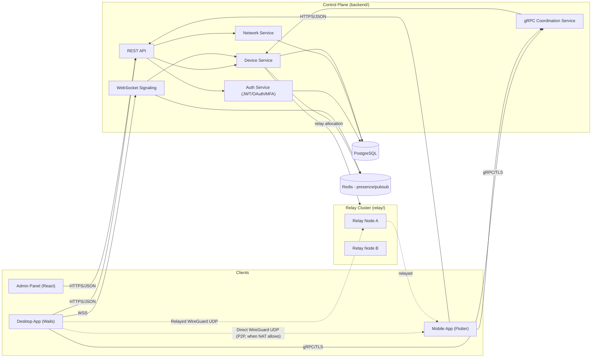
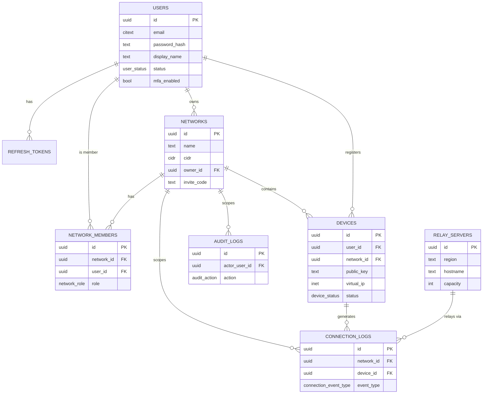
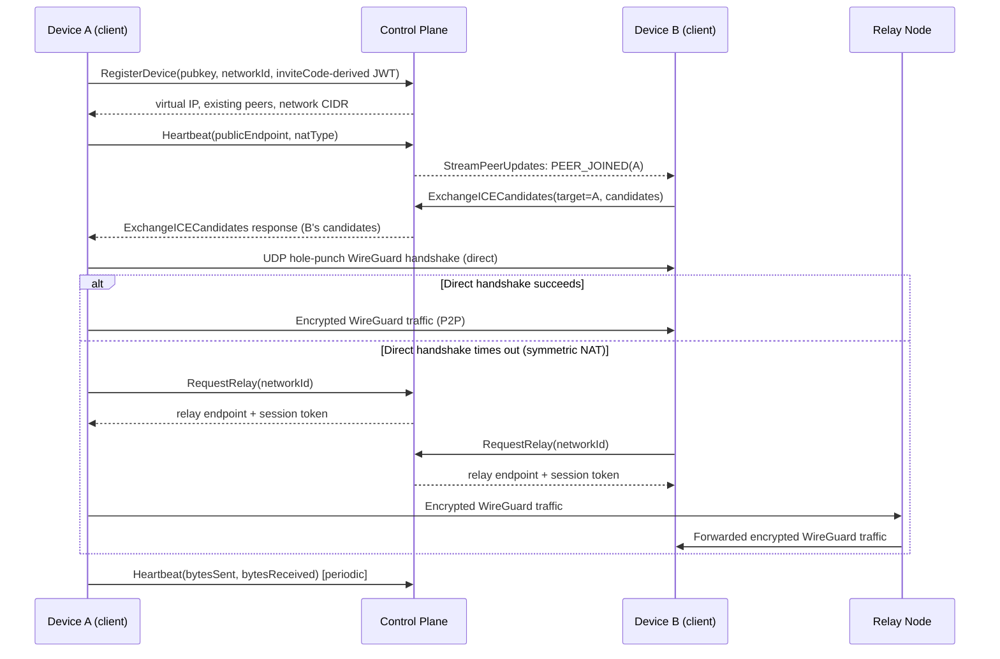
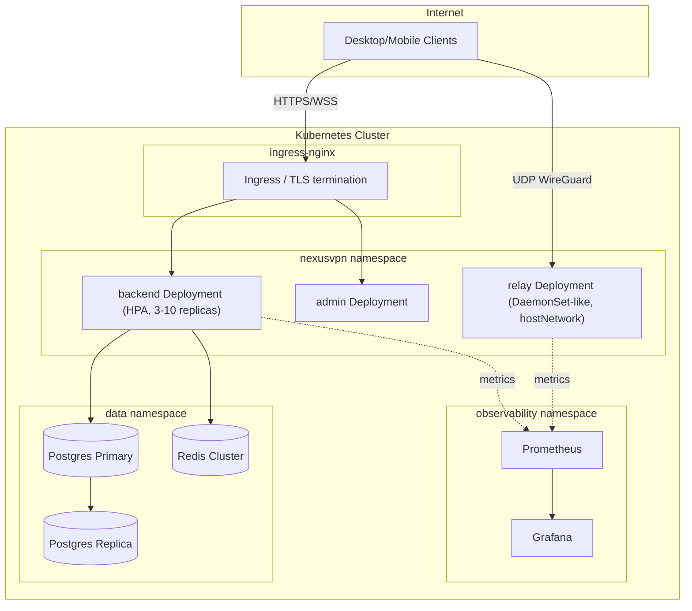

# NexusVPN Architecture

NexusVPN is a self-hostable, open-source virtual LAN / mesh VPN platform in
the spirit of Radmin VPN / Hamachi / Tailscale: a lightweight control plane
issues identity, network membership and peer topology, while data traffic
flows directly between peers over WireGuard whenever NAT allows it, and
falls back to relay servers otherwise.

## Components

| Component | Path | Language | Responsibility |
|---|---|---|---|
| Backend (control plane) | `backend/` | Go | Auth, network/device management, REST+gRPC+WebSocket API, coordination |
| Relay | `relay/` | Go | Stateless UDP relay (TURN-like) for peers that can't establish direct P2P |
| Client core | `client/` | Go | Cross-platform agent: WireGuard interface, STUN/ICE, hole punching, relay client |
| Desktop app | `desktop/` | Go + Wails + React/TS | GUI wrapper around client core for Windows/Windows Server/Linux/macOS |
| Mobile app | `mobile/` | Flutter/Dart | Android/iOS app talking to the same REST API + a platform VPN tunnel service |
| Admin panel | `admin/` | React + TS + Tailwind | Network/device/user administration, dashboards, audit logs |
| SDKs | `sdk/` | Go, TypeScript | Typed clients generated/hand-written against `api/openapi.yaml` |

## High-level architecture

## Connectivity strategy

1. Client registers device + public key with control plane, gets an
   assigned virtual IP inside the network's CIDR.
2. Client performs STUN binding requests against configured STUN servers to
   discover its public (server-reflected) endpoint and classify NAT type
   (open / full-cone / restricted / symmetric).
3. Client reports its endpoint(s) via gRPC `Heartbeat` / gets peer endpoints
   via `StreamPeerUpdates`.
4. For each peer, the client attempts simultaneous UDP hole punching
   (ICE-style candidate exchange via `ExchangeICECandidates`) directly to
   the peer's WireGuard listen port.
5. If direct P2P handshake doesn't complete within a timeout (symmetric NAT
   on both sides, restrictive firewalls), the client calls `RequestRelay`
   and reconfigures the WireGuard peer's endpoint to point at the assigned
   relay node, which forwards encrypted UDP datagrams between the two
   peers without ever decrypting them (WireGuard's own crypto is
   end-to-end; the relay only sees ciphertext).
6. The client continuously monitors handshake freshness and automatically
   retries direct connectivity, falls back to relay, and reconnects on
   network changes (Wi-Fi/cellular switch, sleep/wake).

## Entity relationship diagram

## Sequence: device join + P2P handshake with relay fallback

## Deployment diagram

## Security model

- **Transport**: control-plane REST/gRPC/WS over TLS 1.3. Data plane uses
  WireGuard (Curve25519 for key exchange, ChaCha20-Poly1305 for AEAD).
- **Identity**: JWT access tokens (short-lived, 15 min) + rotating refresh
  tokens (stored hashed, revocable, device-bound).
- **Device keys**: every device generates its own Curve25519 keypair
  locally; the private key never leaves the device. Only the public key is
  registered with the control plane.
- **Certificate/key rotation**: device WireGuard keys can be rotated
  on-demand or on a schedule; rotation invalidates the old public key
  network-wide via the peer update stream.
- **MFA**: TOTP (RFC 6238), enforced optionally per-account.
- **Least privilege**: network roles (`owner`, `admin`, `member`) gate
  invite rotation, member removal, and device management via RBAC
  middleware on every mutating endpoint.
